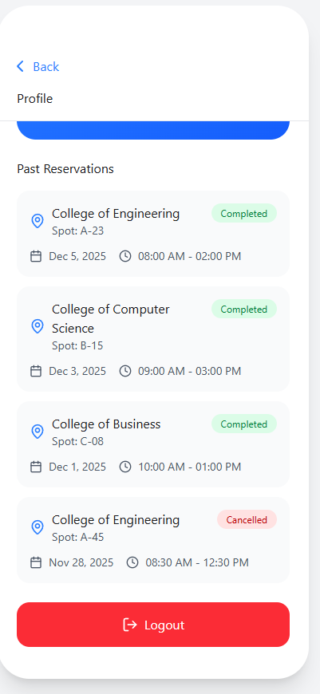

# sahalat-campus-navigation
# Sahalat | Campus Mobility & Parking Solution 🚗

**Sahalat** is a User-Centered Interaction (UCI) project designed to solve the chronic parking congestion at King Saud University (KSU). By combining real-time parking reservations with shuttle bus tracking, the application aims to reduce student tardiness and campus traffic.

**Tools:** Figma, Google Forms, Data Analysis

## 🚩 The Problem
Our initial research surveying 138+ KSU students revealed critical logistics issues:
* **52%** of students spend more than **10 minutes** just searching for a spot.
* **90%** of students reported arriving late to class specifically due to parking issues.
* **88%** of CCIS students reported frustration with the lack of designated parking data.

## 💡 The Solution
Sahalat provides a dual-solution approach to campus mobility:

### 1. Smart Parking Reservation
* **Real-Time Availability:** Visual grid showing Green (Available) vs. Red (Occupied) slots.
* **Hold Timer:** A 10-minute countdown timer locks the spot for the user while they drive to the location.
* **Navigation:** Direct integration with map services to guide the user to the specific slot.

### 2. Shuttle Bus Tracker
* **Live Schedule:** Detailed departure and arrival times for campus shuttles.
* **Stop Locator:** Interactive map showing all bus stops relative to the user's location.

## 🎨 Design Process (HCI Lifecycle)

### Phase 1: User Research
We conducted a demographic and behavioral survey to define our personas.
* **Key Insight:** 83% of students end up parking much farther from their college than preferred.

### Phase 2: Task Analysis
We broke down the user journey into 6 core tasks, including:
1.  **Login:** University credential authentication.
2.  **Reserve:** Filtering by college $\to$ Selecting slot $\to$ Confirming.
3.  **Accessibility:** Configuring color blindness modes (Protanopia/Deuteranopia) and Text-to-Speech.

### Phase 3: Usability Testing & Iteration
We tested the high-fidelity prototype with 10 participants and tracked quantitative metrics.
* **Success Rate:** Achieved an **83.33%** task completion rate.
* **Ease of Use:** Rated **4.6/5** by participants.

#### 🔄 Design Evolution (Based on Testing)
Our testing revealed specific usability flaws which we fixed in the final iteration:
1.  **The Logout Error:** 50% of users tried to logout via "Settings" instead of "Profile".
    **Fix:* Added a redundant Logout button in the Settings menu to match user mental models.
2.  **Map Interaction:** 30% of users tried to zoom in on the Bus Map, which was static.
    *Fix:* Enabled pinch-to-zoom gestures on all map interfaces.
3.  **Login Friction:** Users frequently entered personal emails instead of KSU emails.
    *Fix:* Added bold red warning text and visual cues for "University Credentials".

## 📱 Screenshots

## 👥 The Team
* **Abdullah Bamukhayyar**
* Abdulmalik Alsaleh
* Haidar Alhassan
